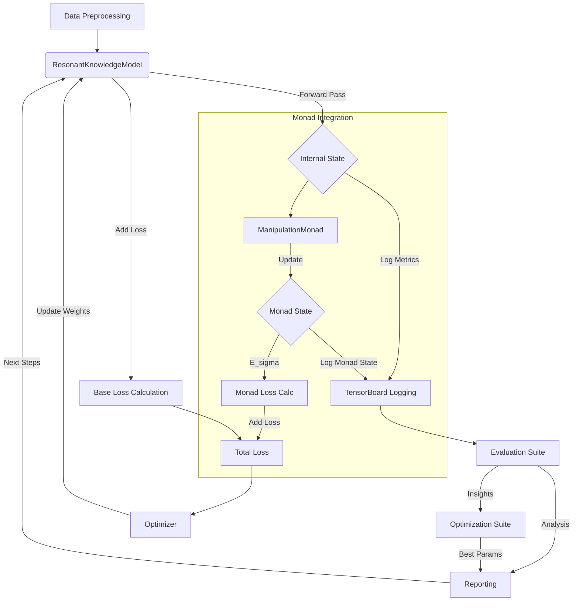

# Resonant Knowledge Model (RKM)

## Introduction

This repository contains the implementation and evaluation framework for the Resonant Knowledge Model (RKM), a novel neural network architecture inspired by principles of quantum mechanics, semantic resonance, and symbolic processing. The project aims to:

1.  Implement the RKM architecture as described in the accompanying theoretical paper (`js/paper.md`).
2.  Train the model on conversational datasets (specifically DailyDialog).
3.  Evaluate the model's behavior and performance against the theoretical predictions using custom metrics and logging.
4.  Optimize the model's hyperparameters based on evaluation insights.

The core idea is to create a fast-learning, low-parameter model that leverages resonance, prime number embeddings, harmonic phase encoding, and an observer-conditioned collapse mechanism.

## Theoretical Background

The RKM architecture is based on a unique formalism combining several concepts:

*   **Prime Hilbert Embedding:** Tokens are embedded into a space derived from prime numbers, incorporating positional phase information.
*   **Mod 9 Harmonic Phase Encoding:** Tokens are assigned a harmonic label based on their index modulo 9, influencing processing.
*   **Resonance Attention:** An iterative attention mechanism designed to converge towards stable, low-entropy states.
*   **Observer-Conditioned Collapse:** A mechanism where a learned "observer" vector influences the final output probabilities, guiding towards specific semantic structures.
*   **Entropy-Modulated Resonant Memory:** A component intended to store and recall resonant attractor states.
*   **Manipulation Monad:** A symbolic processor that tracks entropy and resonance within symbolic states, influencing the main model's dynamics and loss.

For a detailed mathematical and conceptual description, please refer to the formalism document: [`js/paper.md`](js/paper.md).

## Architecture Overview

The system consists of:

1.  **`ResonantKnowledgeModel` (Python/TensorFlow):** The core neural network implementing the prime/phase embeddings, resonance attention blocks, and observer collapse. Found in `python/model/resonant_knowledge_model.py`.
2.  **`ManipulationMonad` (Python):** The symbolic processor interacting with the main model via `tf.py_function` during training. Found in `python/monad/manipulation_monad.py`.
3.  **Custom Loss Function:** Combines standard cross-entropy with penalties derived from the theoretical framework (entropy, dispersion, observer alignment, symbolic entropy). See `python/model/custom_loss.py` and the training loop in `python/train_daily_dialog.py`.



*(Diagram adapted from `evaluation_plan.md`)*

## Implementation Details

*   **Language:** Python
*   **Framework:** TensorFlow 2.x
*   **Dataset:** DailyDialog (loaded via Hugging Face `datasets`)
*   **Tokenization:** Byte Pair Encoding (BPE) via Hugging Face `tokenizers`
*   **Logging:** TensorBoard for detailed metric tracking during training.

## Setup and Installation

1.  **Clone the repository:**
    ```bash
    git clone <repository-url>
    cd <repository-directory>
    ```
2.  **Create a virtual environment (recommended):**
    ```bash
    python -m venv venv
    source venv/bin/activate  # On Windows use `venv\Scripts\activate`
    ```
3.  **Install dependencies:**
    ```bash
    pip install -r requirements.txt
    ```
    *Note: This will install both TensorFlow and PyTorch, as listed in the requirements.*

## Usage

### 1. Download Dataset (if needed)

The training and tokenizer scripts expect the DailyDialog dataset to be available, potentially cached by the Hugging Face `datasets` library (default cache location might be `~/.cache/huggingface/datasets` or locally in `./hf_cache` as specified in `train_daily_dialog.py`). The `train_tokenizer.py` script specifically looks for an Arrow file at `datasets/daily_dialog/default/1.0.0/.../daily_dialog-train.arrow`. Ensure the dataset is downloaded and accessible. You might need to run a script that uses `load_dataset('daily_dialog')` once to trigger the download if it's not present.

### 2. Train Tokenizer

The model requires a custom BPE tokenizer trained on the DailyDialog dataset.

```bash
python train_tokenizer.py
```

This will read the dataset's training split (expected in Arrow format at the path specified in the script) and save the trained tokenizer to `daily_dialog_tokenizer.json` in the project root.

### 3. Train the Model

Run the main training script:

```bash
python python/train_daily_dialog.py
```

This script will:
*   Load the tokenizer (`daily_dialog_tokenizer.json`).
*   Load and preprocess the DailyDialog dataset.
*   Initialize the `ResonantKnowledgeModel` and `ManipulationMonad`.
*   Run the custom training loop for the specified number of epochs.
*   Log detailed metrics (losses, internal states, Monad values) to TensorBoard under `logs/rkm_baseline/`.
*   Save the final model weights to `rkm_daily_dialog_final.weights.h5`.

### 4. Monitor Training

Use TensorBoard to visualize the training progress and logged metrics:

```bash
tensorboard --logdir logs/rkm_baseline
```

Navigate to `http://localhost:6006` (or the port specified by TensorBoard) in your browser.

### 5. Analyze Logs

After training, use the provided script to generate plots from the TensorBoard logs:

```bash
python python/analyze_logs.py <path_to_event_file_or_directory>
```

Replace `<path_to_event_file_or_directory>` with the specific TensorBoard log directory (e.g., `logs/rkm_baseline/YYYYMMDD-HHMMSS/train`). This helps in evaluating the model based on the plan in `evaluation_plan.md`.

### 6. Chat with the Model

Use the interactive chat script to converse with the trained model:

```bash
python python/chat.py --weights rkm_daily_dialog_final.weights.h5 --tokenizer daily_dialog_tokenizer.json
```

This will load the saved weights and tokenizer and provide a command-line interface for chatting.

## Project Structure

```
.
├── .gitignore
├── README.md                 # This file
├── evaluation_plan.md        # Plan for evaluating and optimizing the model
├── requirements.txt          # Python dependencies
├── train_tokenizer.py        # Script to train the BPE tokenizer
├── datasets/                 # Expected location for dataset files (e.g., Arrow format)
├── hf_cache/                 # Local cache for Hugging Face downloads (optional)
├── js/                       # JavaScript related files (paper, potential JS implementation)
│   ├── paper.md              # Theoretical formalism of the RKM
│   └── ...                   # Other JS code (layers, model parts)
├── logs/                     # Directory for TensorBoard logs
│   └── rkm_baseline/
├── python/                   # Main Python implementation
│   ├── __init__.py
│   ├── analyze_logs.py       # Script to plot metrics from TensorBoard logs
│   ├── chat.py               # Interactive chat script
│   ├── index.py              # (Purpose unclear from content)
│   ├── train_daily_dialog.py # Main training script
│   ├── layers/               # Custom TensorFlow layers
│   ├── model/                # RKM model components (TF)
│   ├── monad/                # Manipulation Monad implementation (Python)
│   └── utils/                # Utility functions
└── rkm_daily_dialog_final.weights.h5 # Example output weights file
```

## Evaluation Plan

A detailed plan for evaluating the model against its theoretical claims and optimizing its performance can be found in [`evaluation_plan.md`](evaluation_plan.md).

## License

(License information not specified in the repository)