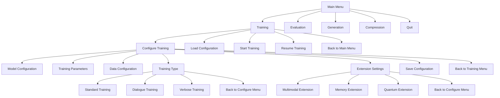
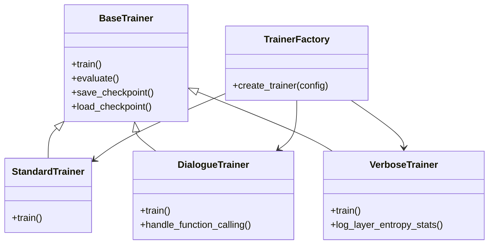
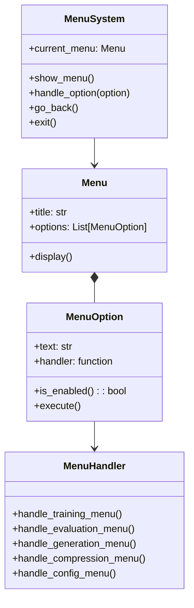
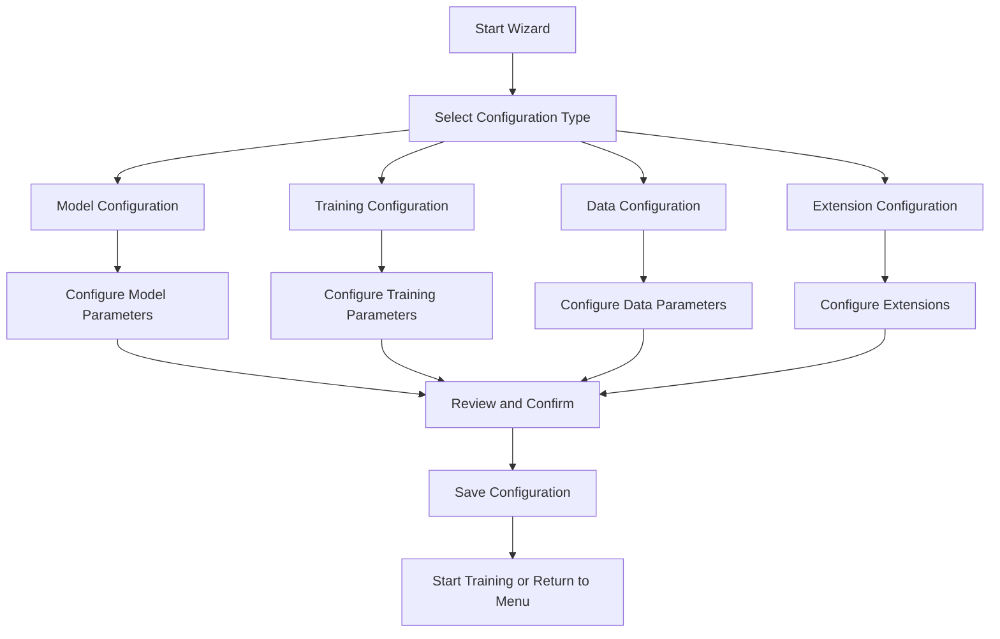
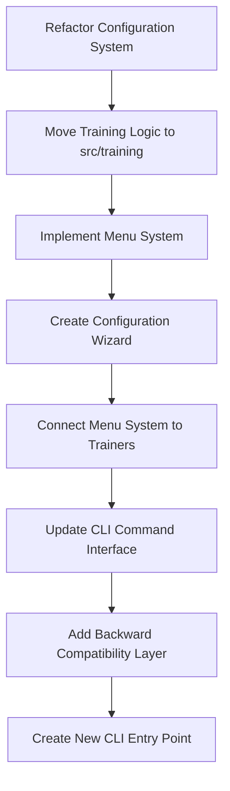

# CLI Refactoring Plan

## Overview

This document outlines the plan for refactoring `main.py`, `train_dialogue.py`, and `train_verbose.py` into a more manageable, menu-driven CLI system. The goals of this refactoring are to:

1. Improve code organization and maintainability
2. Create a more user-friendly interface for configuring training options
3. Centralize configuration management across different training types
4. Maintain backward compatibility with existing command-line arguments

## File Structure

The new file structure will organize the code more logically:

```
qllm/
├── cli.py                  # New main entry point with menu-driven interface
├── main.py                 # Refactored to use new structure but maintain compatibility
├── src/
    ├── cli/
    │   ├── __init__.py
    │   ├── arg_parsing.py      # Refactored argument parsing
    │   ├── commands.py         # Core command implementations
    │   ├── menu_system.py      # New menu system implementation
    │   ├── menu_handlers.py    # Menu option handlers
    │   ├── user_interface.py   # Terminal UI components
    │   └── config_wizard.py    # Configuration wizard functionality
    ├── training/
    │   ├── __init__.py
    │   ├── dialogue_trainer.py    # Extracted from train_dialogue.py
    │   ├── verbose_trainer.py     # Extracted from train_verbose.py
    │   ├── standard_trainer.py    # Standard training functionality
    │   ├── trainer_factory.py     # Factory to create appropriate trainer
    │   └── config_manager.py      # Unified configuration management
    └── config/
        ├── __init__.py
        ├── model_config.py       # Model configuration
        ├── training_config.py    # Training configuration
        ├── data_config.py        # Data configuration
        └── config_schema.py      # Schema defining all config options
```

## Menu Structure

The menu-driven CLI will have the following structure:



## Implementation Plan

### Phase 1: Configuration System Refactoring

1. **Create Configuration Schema**
   - Define a comprehensive schema that includes all configuration parameters from existing training scripts
   - Include type information, valid ranges, default values, and help text
   - Implement validation functions for each parameter type

2. **Implement Configuration Manager**
   - Create functions to load/save configurations from/to JSON files
   - Implement merging of configurations from multiple sources
   - Add validation against the schema

3. **Refactor Existing Configuration Classes**
   - Move `ModelConfig`, `TrainingConfig`, and `DataConfig` to dedicated files
   - Update with additional parameters from all training scripts
   - Add compatibility layers for backward compatibility

**Example Configuration Schema:**

```python
# Example configuration schema design
config_schema = {
    "model": {
        "vocab_size": {
            "type": "int",
            "default": 30000,
            "help": "Vocabulary size for tokenizer",
            "range": [1000, 100000]
        },
        "hidden_dim": {
            "type": "int",
            "default": 768,
            "help": "Size of hidden dimensions",
            "range": [128, 4096]
        },
        # Additional model parameters...
    },
    "training": {
        "batch_size": {
            "type": "int",
            "default": 32,
            "help": "Training batch size",
            "range": [1, 512]
        },
        # Additional training parameters...
    },
    # Additional configuration sections...
}
```

### Phase 2: Training System Refactoring

1. **Create Base Trainer Interface**
   - Define common methods and properties for all trainers
   - Implement shared functionality

2. **Extract Training Logic**
   - Move code from `train_dialogue.py` to `src/training/dialogue_trainer.py`
   - Move code from `train_verbose.py` to `src/training/verbose_trainer.py`
   - Create a standard trainer in `src/training/standard_trainer.py`

3. **Implement Trainer Factory**
   - Create a factory class that selects the appropriate trainer based on configuration
   - Add extension points for future trainer types



### Phase 3: Menu System Implementation

1. **Design Core Menu Classes**
   - Implement `MenuSystem`, `Menu`, and `MenuOption` classes
   - Create a user interface module for terminal interaction

2. **Implement Menu Handlers**
   - Create handler functions for each menu option
   - Connect handlers to the appropriate training/evaluation functions

3. **Develop Configuration Wizard**
   - Create a step-by-step wizard for configuring training
   - Implement parameter validation and help text display
   - Add support for saving/loading configuration presets



4. **Configuration Wizard Flow**



### Phase 4: CLI Integration

1. **Create New Entry Point**
   - Implement `cli.py` as the main entry point for the menu-driven interface
   - Add command-line arguments to control UI mode (menu vs. direct)

2. **Update Existing Scripts**
   - Refactor `main.py` to use the new components
   - Update `train_dialogue.py` and `train_verbose.py` to use the refactored training system
   - Maintain backward compatibility with existing command-line arguments

3. **Add Documentation**
   - Update docstrings and help text
   - Create usage examples for both menu and command-line modes

## Implementation Process Flow



## Component Details

### Configuration Manager

The Configuration Manager will be responsible for:

- Loading configurations from files or command-line arguments
- Saving configurations to files
- Validating configurations against the schema
- Converting between different representation formats (objects, dictionaries, command-line args)

```python
# Example implementation sketch
class ConfigManager:
    def __init__(self, schema=None):
        self.schema = schema or default_schema
    
    def load_config(self, path=None):
        # Load from file if provided
        # Otherwise return defaults
        pass
    
    def save_config(self, config, path):
        # Validate then save
        pass
    
    def validate_config(self, config):
        # Check all parameters against schema
        pass
    
    def merge_configs(self, base, override):
        # Smart merging with validation
        pass
    
    def from_args(self, args):
        # Convert command-line args to config
        pass
    
    def to_args(self, config):
        # Convert config to command-line args
        pass
```

### Configuration Wizard

The Configuration Wizard will guide users through setting up their training configuration:

1. **Introduction**: Explain the configuration process and options
2. **Guided Setup**: Walk through each configuration section
3. **Parameter Entry**: For each parameter, show:
   - Current value
   - Description/help text
   - Valid range or options
   - Default value
4. **Validation**: Validate each entry against schema
5. **Review**: Show complete configuration for review
6. **Save/Execute**: Save configuration to file and/or start training

Example Terminal UI for Configuration:

```
=== Model Configuration ===

Parameter: hidden_dim
Description: Size of hidden dimensions in the model
Current value: 768
Valid range: 128-4096
Enter new value (or press Enter to keep current): 512

Parameter: num_layers
Description: Number of transformer layers
Current value: 6
Valid range: 1-24
Enter new value (or press Enter to keep current): 8

...

=== Review Configuration ===

Model Configuration:
- hidden_dim: 512 (changed from 768)
- num_layers: 8 (changed from 6)
...

Would you like to:
1. Save this configuration
2. Edit configuration
3. Start training with this configuration
4. Return to main menu

Enter your choice (1-4):
```

### Menu System

The menu system will provide a terminal-based user interface with:

1. **Clear Navigation**: Hierarchical menus with breadcrumbs
2. **Consistent Interface**: Standardized display and input handling
3. **Help Text**: Context-sensitive help for each option
4. **State Management**: Tracking of current configuration and state

### Trainer Factory

The Trainer Factory pattern will:

1. Select the appropriate trainer implementation based on configuration
2. Initialize the trainer with the correct parameters
3. Provide a consistent interface for all training types

```python
# Example trainer factory implementation
class TrainerFactory:
    @staticmethod
    def create_trainer(config, **kwargs):
        training_type = config.get("training_type", "standard")
        
        if training_type == "dialogue":
            return DialogueTrainer(config, **kwargs)
        elif training_type == "verbose":
            return VerboseTrainer(config, **kwargs)
        else:
            return StandardTrainer(config, **kwargs)
```

## Migration Strategy

To ensure a smooth transition and maintain backward compatibility:

1. Keep existing entry points (main.py, train_dialogue.py, train_verbose.py) working
2. Add new functionality incrementally in separate files
3. Once new system is stable, update old entry points to use new implementation
4. Add deprecation warnings to old-style usage patterns
5. Document new menu-driven interface for users

## Testing Strategy

1. **Unit Tests**:
   - Configuration validation and normalization
   - Menu system navigation
   - Individual menu handlers

2. **Integration Tests**:
   - Configuration wizard end-to-end
   - Training system with different configurations
   - CLI argument handling

3. **End-to-End Tests**:
   - Complete workflows from menu to training execution
   - Compatibility with existing command-line interfaces

## Conclusion

This refactoring will significantly improve both code organization and user experience by:

1. Centralizing configuration management
2. Providing a user-friendly menu interface
3. Implementing a guided configuration wizard
4. Maintaining backward compatibility

The modular design will also make it easier to add new training options and extend functionality in the future.