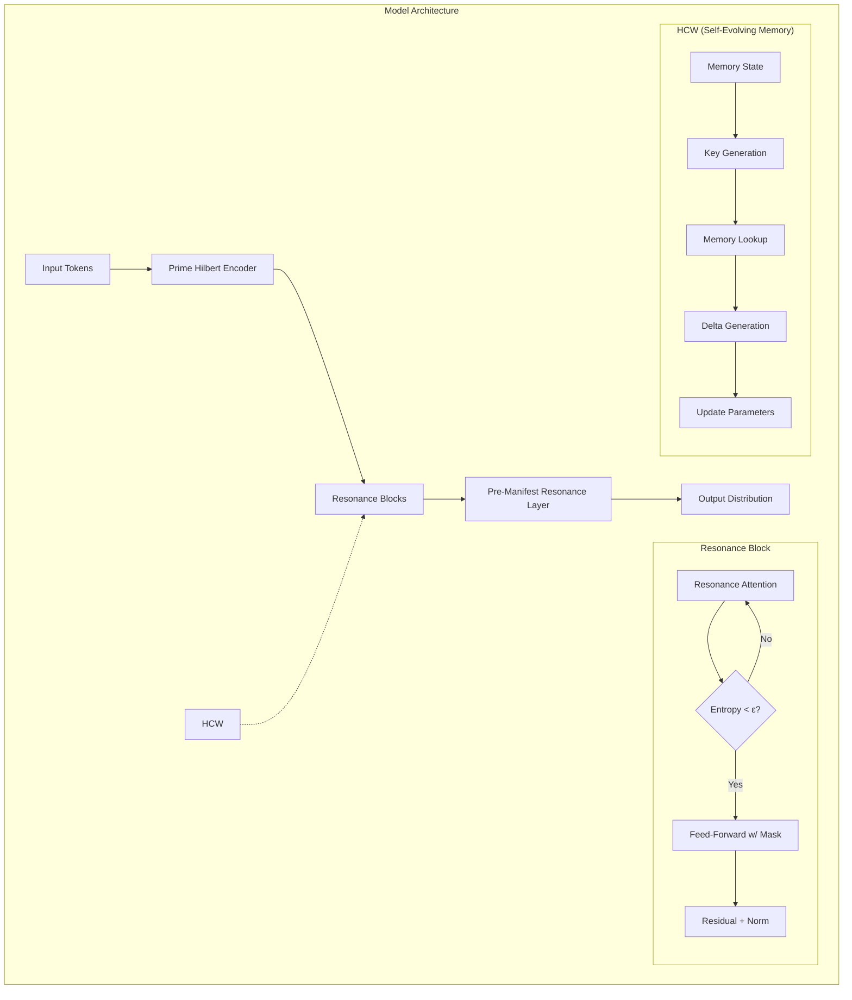

# Implementation Plan: Semantic Resonance Language Model in PyTorch

Based on our discussions and the papers reviewed, this document outlines a comprehensive plan to implement the semantic resonance language model using PyTorch. We'll create a small proof-of-concept model (5-10M parameters) trained on WikiText-103, with evaluation focused on comparing perplexity and accuracy against baseline transformer models of similar size.

## 1. Project Overview

### Architecture Components

The model will consist of four main components as described in the paper:

1. **Prime Hilbert Encoder**: Converts tokens and positions into prime-based subspaces
2. **Resonance Blocks**: Implements iterative attention with entropy-based halting
3. **Self-Evolving Memory (HCW)**: Enables continuous adaptation and learning
4. **Pre-Manifest Resonance Layer**: Refines outputs in superposition before final distribution



## 2. Implementation Roadmap

### Phase 1: Environment Setup & Data Preparation (Estimated: 1 day)

1. **Project Structure**
   - Set up repository with proper organization for models, training, data, and evaluation
   - Configure development environment with PyTorch and required dependencies

2. **Data Processing**
   - Download and preprocess WikiText-103 dataset
   - Implement tokenization and data loading pipelines
   - Create train/validation/test splits

### Phase 2: Core Model Components (Estimated: 3-4 days)

1. **Prime Hilbert Encoder**
   - Implement token and positional embedding in prime-based subspaces
   - Create projections for each prime subspace (p_i)
   - Develop prime-based position encoding methods

2. **Resonance Attention & Blocks**
   - Implement multi-head resonance attention with iterative refinement
   - Add entropy computation and halting mechanism
   - Build feed-forward layers with structured prime resonance masks
   - Integrate residual connections and layer normalization

3. **Self-Evolving Memory (HCW)**
   - Implement memory key generation network
   - Create memory lookup mechanism
   - Build adapter network for delta generation
   - Design update mechanism for contextual weight modification

4. **Pre-Manifest Resonance Layer**
   - Implement final resonance decoding with vocabulary attention
   - Add iterative refinement with entropy-based collapse

### Phase 3: Training Infrastructure (Estimated: 2 days)

1. **Training Loop**
   - Build standard language model training loop with next token prediction
   - Implement entropy regularization and adapter memory constraints
   - Add support for dynamic batch processing with variable computation

2. **Optimization & Scheduling**
   - Configure optimizers and learning rate schedulers
   - Implement gradient clipping and other stability measures
   - Design checkpoint saving and restoration mechanisms

### Phase 4: Evaluation & Benchmarking (Estimated: 2 days)

1. **Metric Collection**
   - Implement perplexity calculation
   - Add accuracy metrics for next token prediction
   - Create visualization tools for entropy reduction and model convergence

2. **Baseline Comparison**
   - Set up standard transformer model of similar size
   - Ensure fair comparison with matched parameter counts
   - Create evaluation pipeline for both models

### Phase 5: Refinement & Optimization (Estimated: 2-3 days)

1. **Performance Optimization**
   - Identify and address bottlenecks in implementation
   - Optimize compute-intensive operations like iterative attention
   - Implement efficient prime-based calculations

2. **Model Compression**
   - Apply structured sparsity through prime resonance masking
   - Measure and compare model size and inference speed
   - Validate preservation of performance with reduced parameters

3. **Fine-tuning & Hyperparameter Optimization**
   - Conduct hyperparameter search for optimal performance
   - Fine-tune entropy thresholds and iteration limits
   - Optimize prime selection for subspace encoding

## 3. Technical Implementation Details

### Prime Hilbert Encoder

```python
class PrimeHilbertEncoder(nn.Module):
    def __init__(self, vocab_size, primes=[7, 11, 13, 17, 19], base_dim=768):
        super().__init__()
        self.primes = primes
        self.base_embedding = nn.Embedding(vocab_size, base_dim)
        self.prime_projections = nn.ModuleList([
            nn.Linear(base_dim, p) for p in primes
        ])
        # Position encoding for each prime subspace
        self.register_buffer('position_table', self._create_position_encodings())
    
    def _create_position_encodings(self):
        # Create sinusoidal position encodings for each prime
        # Returns position encoding table
        ...
    
    def forward(self, tokens, positions):
        # Get base embeddings
        base_embed = self.base_embedding(tokens)
        
        # Project into prime subspaces
        prime_embeds = []
        for i, proj in enumerate(self.prime_projections):
            prime_embed = proj(base_embed)
            # Add position encoding for this prime
            prime_pos = self._get_position_encoding(positions, self.primes[i])
            prime_embeds.append(prime_embed + prime_pos)
        
        # Concatenate all prime-based embeddings
        return torch.cat(prime_embeds, dim=-1)
```

### Resonance Attention

```python
class ResonanceAttention(nn.Module):
    def __init__(self, dim, num_heads, max_iters=10, epsilon=0.1):
        super().__init__()
        self.max_iters = max_iters
        self.epsilon = epsilon
        self.query = nn.Linear(dim, dim)
        self.key = nn.Linear(dim, dim)
        self.value = nn.Linear(dim, dim)
        self.num_heads = num_heads
        self.head_dim = dim // num_heads
        
    def compute_entropy(self, attn_weights):
        # Compute entropy of attention distribution
        # H(p) = -∑ p_i * log(p_i)
        ...
        
    def forward(self, x):
        q = self.query(x)
        k = self.key(x)
        v = self.value(x)
        
        # Reshape for multi-head attention
        batch_size, seq_len = x.shape[:2]
        q = q.view(batch_size, seq_len, self.num_heads, self.head_dim).transpose(1, 2)
        k = k.view(batch_size, seq_len, self.num_heads, self.head_dim).transpose(1, 2)
        v = v.view(batch_size, seq_len, self.num_heads, self.head_dim).transpose(1, 2)
        
        # Iterative attention refinement
        for t in range(self.max_iters):
            attn_scores = torch.matmul(q, k.transpose(-2, -1)) / math.sqrt(self.head_dim)
            attn_weights = F.softmax(attn_scores, dim=-1)
            
            # Calculate entropy of attention weights
            entropy = self.compute_entropy(attn_weights)
            
            # Break if entropy is below threshold
            if entropy < self.epsilon:
                break
            
            # Apply attention and update x for next iteration
            output = torch.matmul(attn_weights, v)
            output = output.transpose(1, 2).contiguous().view(batch_size, seq_len, -1)
            
        return output, entropy, t+1  # Return output, final entropy, and iterations used
```

### Self-Evolving Memory (HCW)

```python
class HomomorphicComputationalWrapper(nn.Module):
    def __init__(self, hidden_dim, memory_size=1000):
        super().__init__()
        self.key_net = nn.Sequential(
            nn.Linear(hidden_dim, hidden_dim // 2),
            nn.ReLU(),
            nn.Linear(hidden_dim // 2, 128)  # Memory key size
        )
        
        # Initialize episodic memory
        self.memory_keys = nn.Parameter(torch.randn(memory_size, 128))
        self.memory_values = nn.Parameter(torch.randn(memory_size, hidden_dim))
        
        # Adapter network for delta generation
        self.adapter_net = nn.Sequential(
            nn.Linear(hidden_dim, hidden_dim * 2),
            nn.ReLU(),
            nn.Linear(hidden_dim * 2, hidden_dim)
        )
        
    def forward(self, x):
        # Generate memory key from input
        key = self.key_net(x)
        
        # Memory lookup via attention
        key_norm = F.normalize(key, dim=-1)
        mem_norm = F.normalize(self.memory_keys, dim=-1)
        
        # Compute attention scores
        attn = torch.matmul(key_norm, mem_norm.transpose(-2, -1))
        attn_weights = F.softmax(attn, dim=-1)
        
        # Retrieve memory value
        memory_value = torch.matmul(attn_weights, self.memory_values)
        
        # Generate weight delta
        delta = self.adapter_net(memory_value)
        
        return delta
```

### Prime Resonance Mask

```python
def create_prime_resonance_mask(dim, primes=[7, 11, 13, 17, 19]):
    """Create a structured mask based on prime resonance conditions."""
    mask = torch.zeros((dim, dim), dtype=torch.bool)
    
    # Set indices to 1 if they pass the prime resonance condition
    for i in range(dim):
        for j in range(dim):
            # Example condition: (i-j) mod p = 0 for some prime p
            if any((i-j) % p == 0 for p in primes):
                mask[i, j] = 1
                
    return mask
```

## 4. Training & Evaluation Workflow

### Data Pipeline

1. **Tokenizer**: Use a byte-pair encoding tokenizer for the WikiText-103 dataset
2. **Dataloader**: Create efficient dataloaders with appropriate sequence lengths
3. **Batching**: Implement dynamic batching to handle variable computation

### Training Pipeline

1. **Initial Training**: Train the model on WikiText-103 with standard cross-entropy loss
2. **Monitoring**: Track perplexity, loss, and entropy reduction during training
3. **Checkpointing**: Save model at regular intervals and on best validation perplexity

### Evaluation Protocol

1. **Baseline Comparison**: Compare against a standard transformer model of similar size
2. **Metrics**: Measure perplexity on validation and test sets
3. **Efficiency**: Track parameter count, training time, and inference speed

## 5. Deliverables

1. **Codebase**:
   - Complete PyTorch implementation of the semantic resonance language model
   - Data processing, training, and evaluation scripts
   - Configuration files for model variants and experimental settings

2. **Trained Models**:
   - Small-scale proof-of-concept model (5-10M parameters)
   - Baseline transformer model of comparable size
   - Compressed version using prime resonance masking

3. **Evaluation Results**:
   - Comparison of perplexity and accuracy metrics
   - Analysis of model efficiency and compression rates
   - Visualization of model behavior and entropy dynamics

4. **Documentation**:
   - Implementation details and architecture explanation
   - Usage instructions and examples
   - Experimental findings and insights

## 6. Timeline

| Phase | Duration | Tasks |
|-------|----------|-------|
| 1. Setup & Data | 1 day | Environment setup, data preparation |
| 2. Core Components | 3-4 days | Implement model architecture |
| 3. Training Infrastructure | 2 days | Build training pipeline |
| 4. Evaluation | 2 days | Implement metrics and baselines |
| 5. Refinement | 2-3 days | Optimize and fine-tune model |
| **Total** | **10-12 days** | **Complete implementation** |