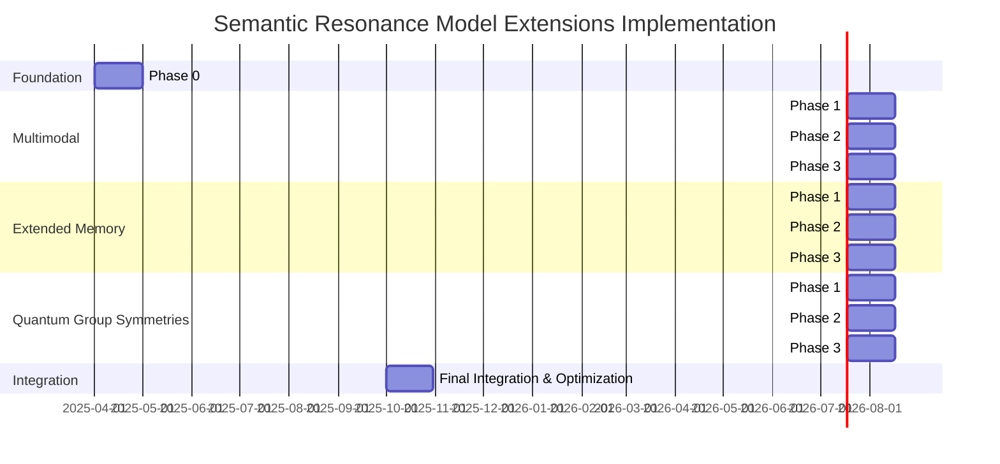

# Semantic Resonance Model Extensions: Implementation Plan

## Overview

Based on a comprehensive review of the codebase and requirements, this document outlines a phased approach to implement all three major extensions (Multimodal, Quantum Group Symmetries, and Extended Memory) in parallel while addressing the scaling limitations of the current model.

The implementation plan is divided into four phases, with parallel workstreams for each extension. This approach allows us to incrementally build and test each extension while ensuring they integrate properly with the core architecture.



## Phase 0: Foundation - Scaling & Infrastructure (1 month)

Before implementing the extensions, we need to address the scaling limitations and prepare the infrastructure:

### Tasks:
1. **Scaling Enhancements**:
   - Implement model parallelism across multiple GPUs
   - Optimize the resonance attention mechanism for better memory efficiency
   - Add gradient checkpointing for training larger models

2. **Extension Integration Framework**:
   - Create a modular extension architecture to plug in new capabilities
   - Design interfaces for each extension type
   - Implement feature flags and configuration options

3. **Metrics and Evaluation Pipeline**:
   - Build evaluation framework for cross-modal performance
   - Implement compression ratio measurement utilities
   - Create convergence speed benchmarking tools

## Phase 1: Initial Implementation (1 month per extension)

Each extension will start with its basic implementation:

### Multimodal Extension:
1. **Image Encoder Integration**:
   - Implement a prime-based vision encoder using ResNet or ViT backbone
   - Create image tokenization mechanism
   - Extend the Prime Hilbert Encoder for image features

2. **Multimodal Dataset Pipeline**:
   - Set up image-text paired datasets
   - Create multimodal batch processing utilities
   - Implement augmentation techniques

### Extended Memory:
1. **Knowledge Graph Structure**:
   - Design the graph database schema for memory storage
   - Implement key-value storage with relation metadata
   - Create memory persistence layer

2. **Memory Interface**:
   - Extend the HCW to support structured knowledge
   - Implement graph traversal utilities
   - Create memory indexing mechanisms

### Quantum Group Symmetries:
1. **Advanced Masking Framework**:
   - Implement group theory-based masking strategies
   - Create configuration system for different symmetry types
   - Develop adaptive mask generation

## Phase 2: Enhancement & Integration (1 month per extension)

In this phase, we expand the capabilities and integrate with the core model:

### Multimodal Extension:
1. **Audio Modality Support**:
   - Implement audio encoder with Fourier-based features
   - Create audio preprocessing pipeline
   - Integrate with the existing image-text framework

2. **Cross-Modal Attention**:
   - Create specialized resonance blocks for cross-modal attention
   - Implement modality-specific entropy thresholds
   - Design "bridge" layers between modalities

### Extended Memory:
1. **Retrieval Mechanism**:
   - Implement context-aware memory retrieval
   - Create importance sampling for memory access
   - Develop episodic and semantic memory separation

2. **Memory Compression**:
   - Implement prime resonance-based memory compression
   - Create hierarchical memory structure
   - Design memory pruning mechanisms

### Quantum Group Symmetries:
1. **Group Transformations**:
   - Implement Lie group transformations
   - Create equivariant layer operations
   - Develop symmetry-preserving regularization

2. **Integration with Attention**:
   - Modify resonance attention for group symmetry awareness
   - Implement efficient group convolution operations
   - Create symmetry-based attention patterns

## Phase 3: Advanced Features (1 month per extension)

In the final implementation phase, we add sophisticated capabilities:

### Multimodal Extension:
1. **Joint Representation Learning**:
   - Implement contrastive learning objectives
   - Create multimodal fusion techniques
   - Develop cross-modal generation capabilities

2. **Prime-Based Multimodal Encoding**:
   - Extend prime number representations across modalities
   - Implement modality-specific primes
   - Create unified embedding space

### Extended Memory:
1. **Incremental Learning**:
   - Implement continual learning with knowledge distillation
   - Create experience replay mechanisms
   - Develop catastrophic forgetting mitigation

2. **Memory-Guided Generation**:
   - Implement memory-conditioned text generation
   - Create memory retrieval during inference
   - Develop fact verification against memory

### Quantum Group Symmetries:
1. **Symmetry-Aware Attention**:
   - Implement group-equivariant attention mechanisms
   - Create symmetry-preserving positional encodings
   - Develop automatic symmetry discovery

2. **Advanced Group Operations**:
   - Implement higher-order group transformations
   - Create group-based regularization
   - Develop adaptive symmetry selection

## Final Integration Phase (1 month)

1. **Unified Model**:
   - Integrate all extensions into a cohesive architecture
   - Resolve conflicts and optimize interactions
   - Create comprehensive configuration system

2. **Performance Optimization**:
   - Implement joint training objectives
   - Optimize memory usage across extensions
   - Create inference acceleration techniques

3. **Final Evaluation**:
   - Conduct comprehensive benchmarking
   - Measure against success metrics
   - Document performance characteristics

## Implementation Details

### Scaling Enhancements
- Add model parallelism capability through tensor parallelism
- Optimize resonance attention with efficient sparse attention patterns
- Implement adaptive computation based on input complexity

### Multimodal Support Technical Approach
- Use prime-based projection matrices for image feature mapping
- Implement cross-modal entropy calculation for halting criteria
- Create modality-specific positional encodings

### Extended Memory Architecture
- Use graph database structure with tunable compression
- Implement fast indexing with approximate nearest neighbors
- Create adaptive forgetting mechanism with importance sampling

### Quantum Group Symmetries Implementation
- Use prime factorization for group representation
- Implement symmetry-preserving attention masks
- Create adaptive symmetry discovery mechanisms

## Success Metrics & Evaluation

1. **Cross-Modal Performance**:
   - Zero-shot image classification accuracy
   - Image-text retrieval precision
   - Cross-modal generation quality

2. **Memory Compression Ratio**:
   - Knowledge retention with reduced parameters
   - Storage efficiency for episodic memories
   - Retrieval accuracy vs. compression level

3. **Convergence Speed**:
   - Training iterations to target performance
   - Adaptive computation efficiency
   - Fine-tuning speed for new domains

4. **Overall Model Enhancements**:
   - Parameter efficiency vs. baseline models
   - Inference speed at various scales
   - Adaptation to new domains/data

## Code Structure

The extensions will be implemented with the following structure:

```
src/
  model/
    multimodal/
      vision_encoder.py
      audio_encoder.py
      cross_modal_attention.py
      fusion.py
    memory/
      knowledge_graph.py
      retrieval.py
      incremental_learning.py
    quantum/
      group_masks.py
      symmetry_operations.py
      equivariant_layers.py
  data/
    multimodal/
      image_text_dataset.py
      audio_dataset.py
    memory/
      graph_storage.py
  training/
    multimodal_trainer.py
    memory_enhanced_trainer.py
    symmetric_trainer.py
  evaluation/
    cross_modal_metrics.py
    memory_benchmarks.py
    convergence_metrics.py
```

## Dependencies and Requirements

- PyTorch 2.0+
- torchvision for image processing
- torchaudio for audio processing
- NetworkX or similar for graph operations
- DGL (Deep Graph Library) for knowledge graph implementation
- FAISS for memory indexing and retrieval
- HuggingFace Datasets and Transformers for multimodal datasets

## Risk Assessment

1. **Integration Challenges**:
   - Risk: Extensions may have conflicting requirements or interactions
   - Mitigation: Clear interface definitions, regular integration testing

2. **Performance Overhead**:
   - Risk: Extensions may significantly increase computational requirements
   - Mitigation: Progressive optimization, feature toggles, efficiency benchmarking

3. **Complexity Management**:
   - Risk: Increased codebase complexity may reduce maintainability
   - Mitigation: Comprehensive documentation, modular design, clear abstractions

## Conclusion

This implementation plan provides a structured approach to enhancing the Semantic Resonance Model with three major extensions while addressing scaling limitations. By following this phased approach with parallel workstreams, we can incrementally build and test each extension, ensuring they integrate properly with the core architecture while maintaining the quantum-inspired principles that make the model unique.